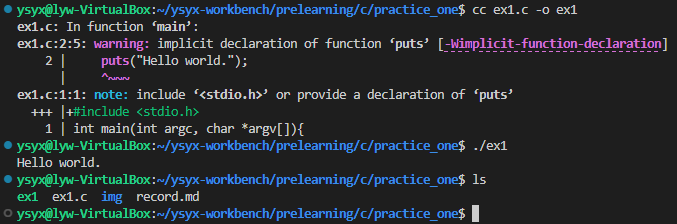
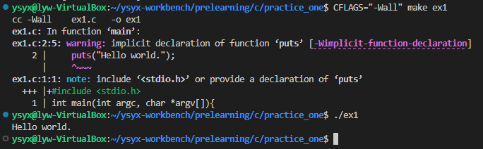

# 任务
https://www.cntofu.com/book/25/ex1.md


# 实验1
1. 将下面代码写入ex1.c
```c
int main(int argc, char *argv[]){
    puts("Hello world.");
    return 0;
}
```
2. 进行编译
```c
cc ex1.c -o ex1
```
实验结果如下,可以正常输出 Hello world.


3. 打开所有编译警告重新构建
```c
CFLAGS="-Wall" make ex1
```
结果如下


添加下面一行,编译器就不报警告了
```c
#include<stdio.h>
```